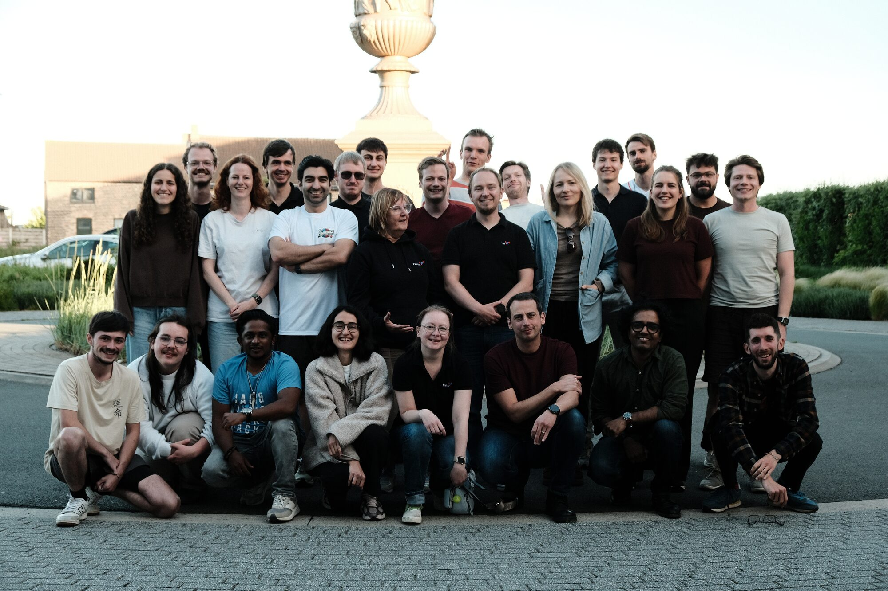
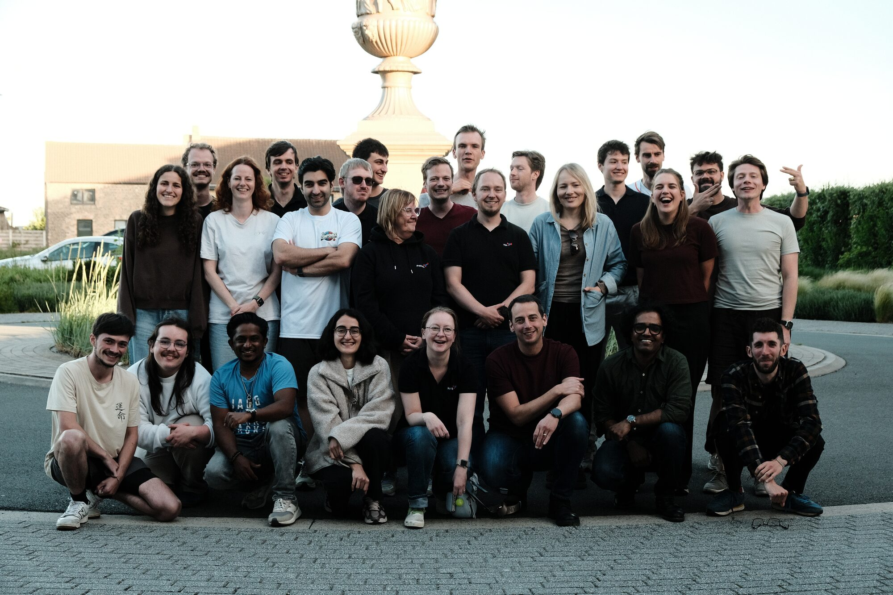
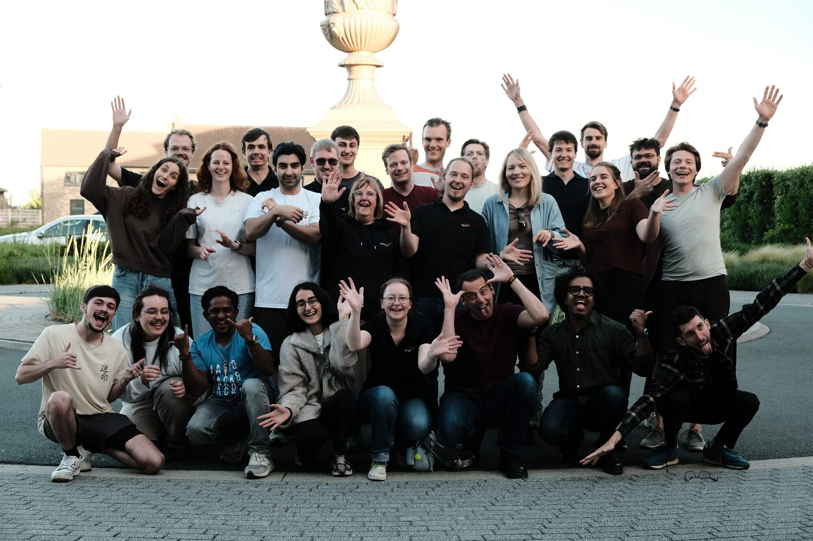
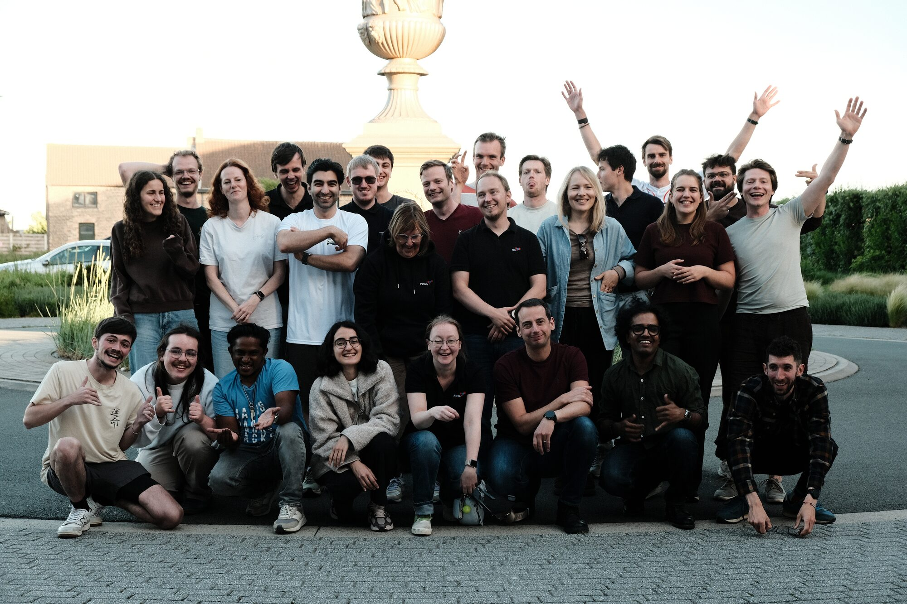

```{=html}
<div id="cmp-bg" aria-hidden="true">
  
  
  
  
  
</div>

<div class="cmp-scenes">
  <section class="cmp-scene cmp-scene-hero">
    <div class="cmp-wrap">
      <div class="cmp-hero-copy">
        <div class="cmp-hero-titlerow" id="cmp-hero-reveal">
          
          <h1 class="cmp-hero-title">CompOmics</h1>
        </div>
        <p class="cmp-scrollcue">Scroll</p>
      </div>
    </div>
  </section>

  <section class="cmp-scene cmp-scene-vision">
    <div class="cmp-wrap">
      <div class="cmp-vision-v2">
        <div class="cmp-panel-kicker">Our vision</div>
        <h2 class="cmp-vision-v2-headline">Computational proteomics,<br>open to all.</h2>
        <p class="cmp-vision-v2-lead">We unlock the full potential of mass spectrometry data — making proteomics faster, more accurate, and accessible worldwide through open-source tools and community resources.</p>
        <div class="cmp-vision-pillars">
          <div class="cmp-pillar">
            <i class="bi bi-lightning-charge cmp-pillar-icon"></i>
            <div class="cmp-pillar-title">Algorithmic Innovation</div>
            <p class="cmp-pillar-desc">Novel methods for spectrum interpretation, peptide identification, and large-scale protein quantification.</p>
          </div>
          <div class="cmp-pillar">
            <i class="bi bi-layers cmp-pillar-icon"></i>
            <div class="cmp-pillar-title">Machine Learning</div>
            <p class="cmp-pillar-desc">AI-driven models for retention time and fragmentation prediction, trained on community-scale proteomics data.</p>
          </div>
          <div class="cmp-pillar">
            <i class="bi bi-globe2 cmp-pillar-icon"></i>
            <div class="cmp-pillar-title">Open Data Standards</div>
            <p class="cmp-pillar-desc">FAIR-compliant sharing via PRIDE, ProteomeXchange, and community formats — all software and data built to last.</p>
          </div>
        </div>
      </div>
    </div>
  </section>

  <section class="cmp-scene cmp-scene-tools">
    <div class="cmp-wrap">
      <div class="cmp-vision-v2">
        <div class="cmp-panel-kicker">Explore our work</div>
        <h2 class="cmp-vision-v2-headline">Tools and publications</h2>
        <div class="nav-tiles-row cmp-tiles-row">
          <a href="tools/" class="nav-tile">
            <i class="bi bi-tools nav-tile-icon"></i>
            <div class="nav-tile-title">Tools</div>
            <div class="nav-tile-desc">Open-source software for proteomics data analysis</div>
          </a>
          <a href="publications/" class="nav-tile">
            <i class="bi bi-journal-text nav-tile-icon"></i>
            <div class="nav-tile-title">Publications</div>
            <div class="nav-tile-desc">Our research output and scientific papers</div>
          </a>
        </div>
      </div>
    </div>
  </section>

  <section class="cmp-scene cmp-scene-team">
    <div class="cmp-wrap cmp-team-wrap">
      <div class="cmp-team-copy">
        <div class="cmp-panel-kicker">People</div>
        <h2 class="cmp-h-light">Meet the team</h2>
        <p class="cmp-sub-light">Researchers, developers, and support staff behind the CompOmics platform.</p>
        <a href="team/" class="cmp-btn">Visit the team page</a>
      </div>
    </div>
  </section>

  <section class="cmp-scene cmp-scene-location">
    <div class="cmp-wrap cmp-location-wrap">
      <div class="location-section">
        <div class="location-info">
          <span class="location-eyebrow">Visit us</span>
          <h2 class="location-title">Where to find us</h2>
          <div class="location-group">Computational Omics and Systems Biology Group</div>
          <p class="location-affil">Department of Biomolecular Medicine, Ghent University<br>
          VIB-UGent Center for Medical Biotechnology, VIB</p>

          <div class="location-row">
            <i class="bi bi-geo-alt location-row-icon"></i>
            <div>Technologiepark 75<br>9052 Gent-Zwijnaarde, Belgium</div>
          </div>
          <div class="location-row">
            <i class="bi bi-envelope location-row-icon"></i>
            <div><a href="mailto:lennart.martens@UGent.be">lennart.martens@UGent.be</a></div>
          </div>

          <a class="location-directions" href="https://www.google.com/maps/dir/?api=1&destination=Technologiepark+75,+9052+Zwijnaarde,+Belgium" target="_blank" rel="noopener noreferrer">
            <i class="bi bi-signpost-2"></i> Get directions
          </a>
        </div>
        <div class="location-map">
          <iframe
            src="https://www.google.com/maps/embed?pb=!1m18!1m12!1m3!1d2507.204!2d3.7105!3d51.0028!2m3!1f0!2f0!3f0!3m2!1i1024!2i768!4f13.1!3m3!1m2!1s0x47c373d77b8d06cd%3A0x8f5c2b9d70bbdee4!2sTechnologiepark%2075%2C%209052%20Zwijnaarde!5e0!3m2!1snl!2sbe!4v1717939200000"
            width="100%" height="100%" style="border:0;"
            allowfullscreen="" loading="lazy"
            referrerpolicy="no-referrer-when-downgrade">
          </iframe>
        </div>
      </div>
    </div>
  </section>
</div>

```
